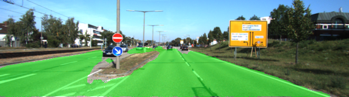

# Semantic Segmentation

### Introduction
In this project the goal is to label the pixels of a road in images using a Fully Convolutional Network (FCN).

### Results

Below are some example images that show the results of the modell. As we can see the model performs relatively well in good lighting conditions but has difficulty correctly identifying all pixels of the road when big patches of shadow are present. 

#### Good examples:

| | | |
|:-------------------------:|:-------------------------:|:-------------------------:|
|  |  ||
|  |  ||
|  |  ||
|  |  ||

#### Bad examples:

| | | |
|:-------------------------:|:-------------------------:|:-------------------------:|
|  |  ||
|  |  ||

### Setup

##### Frameworks and Packages
Make sure you have the following is installed:
 - [Python 3](https://www.python.org/)
 - [TensorFlow](https://www.tensorflow.org/)
 - [NumPy](http://www.numpy.org/)
 - [SciPy](https://www.scipy.org/)
 
 To install all the required dependencies run:
 
 ```
 make setup
 ```
 
 This will create a python3 virtaulenv and install all the required dependencies as defined in `requirements.txt`
 
##### Dataset
Download the [Kitti Road dataset](http://www.cvlibs.net/datasets/kitti/eval_road.php) from [here](http://www.cvlibs.net/download.php?file=data_road.zip).  Extract the dataset in the `data` folder.  This will create the folder `data_road` with all the training a test images.

##### Run
Run the following command to run the project:
```
python main.py
```

**Note** If running this in Jupyter Notebook system messages, such as those regarding test status, may appear in the terminal rather than the notebook.
